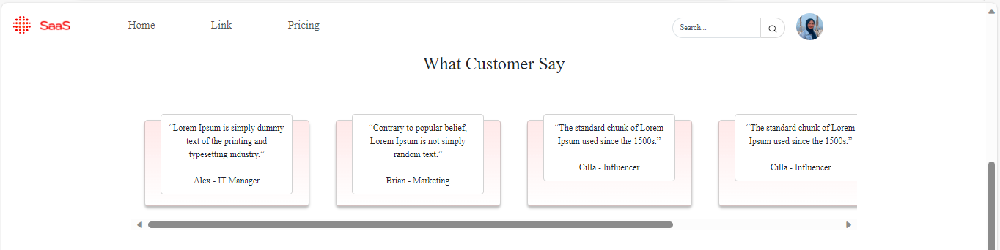
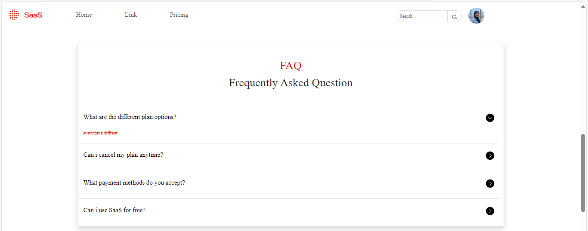
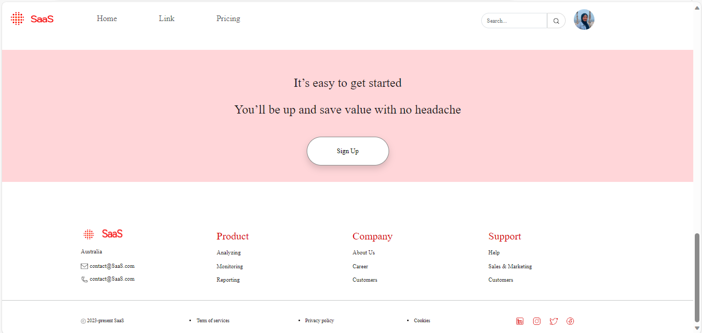
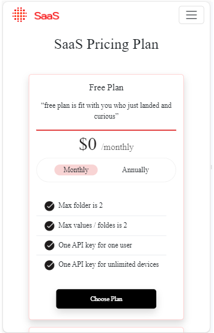
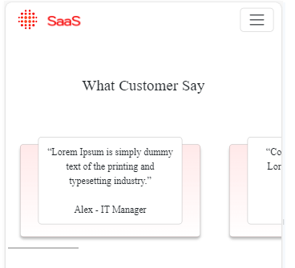
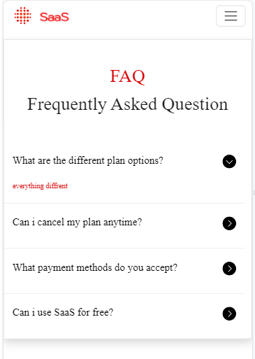
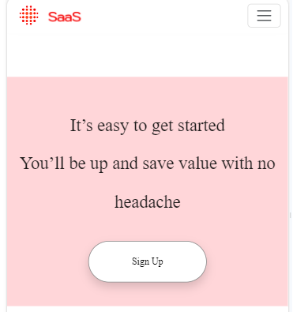
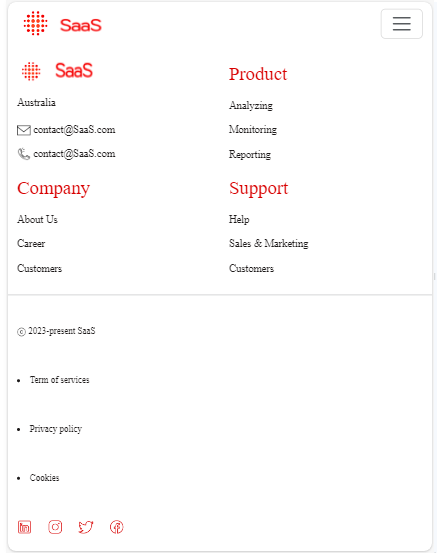

# Simple Pricing Plan Website

### What is simple pricing plan website ?

### This simple pricing plan website is the website that contain :

1. Responsive Navigation Bar
2. Responsive Pricing Plan
3. Responsive Customer Review / Say
4. Responsive FAQ (Frequently Asked Question)
5. Responsive Get Started Button
6. Responsive Footer

### Tools I Used :

1. HTML
2. CSS (Boostrap Framework)
3. JavaScript
4. IDE (VsCode)
5. Design (Figma)

### Simple Pricing Plan Website Overview Dekstop Screen

### Simple Pricing Plan Website Overview Mobile Screen

### Design Overview :

Dribble Account (https://dribbble.com/dianalingga)
